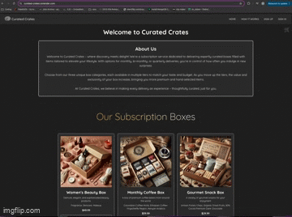

# Curated Creates

## Table of Contents

- [Description](#description)
- [Technologies Used](#technologies-used)
- [Live Web Page](#live-web-page)
- [Example Of Functional Site](#example-of-functional-site)
- [Contact](#contact)

## Description

Curated Crates is a lifestyle subscription service delivering handpicked, premium items designed to elevate your everyday. With flexible delivery options, we bring unique surprises right to your doorstep. Choose from three distinct box categories, each with multiple tiers for added exclusivity and value. At Curated Crates, every box is more than a delivery; it's a curated experience just for you.

## Technologies Used

### Front-End
- React
- JavaScript
- HTML
- MUI

### Back-End
- Express.js
- Node.js
- MongoDB

### Database

- MongoDB
- Mongoose

## Live Web Page

[Click Here To View Webpage](https://curated-crates.onrender.com/)

## Example Of Functional Site

## Contact

For questions about this application please reach out on Github or email.

- GitHub: [Chris Natale](https://github.com/natale565)
- GitHub: [Joshua Robertson](https://github.com/JMRobertson89)
- GitHub: [Scott Reynolds](https://github.com/scottreynolds6294)
- GitHub: [Seth Valentine](https://github.com/Sethav123)

